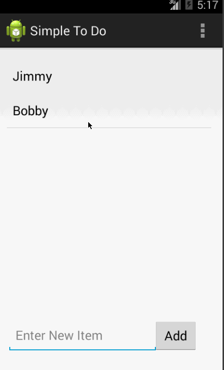
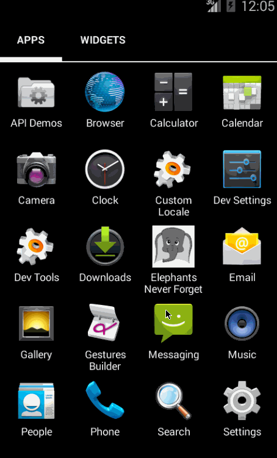
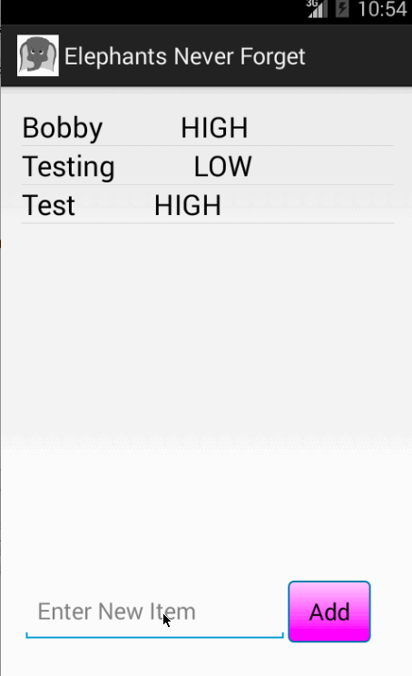

ToDo
====
This is an Android Application for the To Do List.

Time Spent (Coding App): 4 hours (including watching videos)
Time Spent (Setup): too much and ongoing.... Had difficulties with Eclipse on my computer, but was able to set up the Android Studio v19 late yesterday and get the app built.

Completed User Stories:

* [x] First Version of the App, [ToDoActivity] a list of ToDo Items Saved to file that can have items added to it (text field and Add button) or removed from it (long click)
* [x] Edit feature added to the First Version, a click of an item in To Do list leads to the next activity [EditItemActivity] where you can edit that item and then Save and return to the [ToDoActivity] where your changes will be reflected and saved to file.

Notes:  Extension to be added today. 

Walkthrough of all user stories:




Styling Modifications:

* [x] Added a drawable for the buttons, with a pink gradient background coloring.
* [x] Changed the app logo to an elephant
* [x] Changed the app to be centered around the idea that an elephant never forgets
* [x] Modified the text field and button width at the top of the Edit Activity [EditItemActivity] and added the elephant image again
* [x] Remove the unused dropdown menu from the Activity Bar in the app.

Walkthrough of the user stories with add ons:



Basic Priorities (without styling):

* [x] Added a custom ArrayAdapter to support priority information
* [x] Added a custom class (```ToDoItem```) to help with representing the data in the to do list
* [x] Added Checkbox to Edit View to allow users to change the priority of a to do item.

Walkthrough of the user stories with basic priorities:



GIFs created with [LiceCap](http://www.cockos.com/licecap/).


